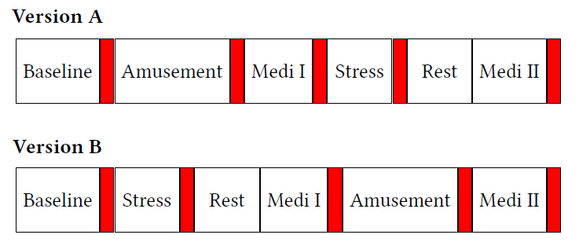

```{r setup, include=FALSE}
knitr::opts_chunk$set(
	echo = FALSE,
	warning = FALSE,
	cache = TRUE
)
library(ggplot2)
library(tidyverse)
library(knitr)
library(kableExtra)
library(corrplot)
library(caret)
library(rpart)
library(e1071)
library(randomForest)
library(MLmetrics)
```


# Introduction

Stressors have a major influence on our mood, sense of well-being, behavior, and health[5]. Stress response is a physiological response to a stimulus, during which a mixture of hormones like cortisol or adrenaline is released, leading to an increased breathing or heart rate and muscle tension. These physiological changes prepare the organism for a physical reaction and can be detected by sensors on wearable electronic devices. Although acute stress responses in young, healthy individuals typically do not impose a health burden, studies have shown that, if not treated properly, long-term stress can lead to serious health problems, including cardiovascular disease, mental health problems, obesity, eating disorders, and menstrual problems[5].

Many physiological signals are proved to be closely related to the state of cognitive stress. For example, some physiological studies show that electrodermal activity (EDA), a measure of the changes in conductance at the skin surface due to sweat production, is sensitive to cognitive stress, and thus can be used as a potential predictor[6]. In addition, stress is shown to be characterized by an increased respiratory rate (RESP)[7], which measures a person's breathing frequency. Also to be noted is that physiological signals tend to be user-dependent[4]. Thus, this independent study will apply both a data-driven and domain-driven approach to predict the individual affective states. 

Specifically, the study will apply machine learning models based on peripheral physiological data obtained through wearables to predict the affective state (stress, non-stress, and amusement) of a subject. The goal includes determining which types of sensors are most useful in predicting stress, how accurate the model can be for within-subject classification, and what combination of features can achieve the highest possible accuracy. The study will focus mainly on seven physiology sensors (ACC, RESP, EGG, EDA, EMG, TEMP, BVP) that are most widely used for stress detection in the physiology literature and conducting features engineering.


# Literature Reviews

In recent years, many studies have been conducted to detect stress based on physiological signals. \emph{Schmidt et al}[1] collected the WESAD dataset and identified the most effective wearable sensors in detecting stress by constructing more than 100 features and training on random forest, decision tree, AdaBoost DT, linear discriminant analysis, and kNN. They achieved 80% classification accuracy for the three-class (baseline vs. stress vs. amusement) problem and 93% for the binary classification problem (stress vs. non-stress). \emph{Picard et al}[2] achieved 81% accuracy on eight classes of emotion using six common statistics for signal processing, including mean, standard, means of absolute values of the first differences of the raw signals, etc. Base on those studies, multi-class problem (non-stress vs. stress vs. others) is proved to be more difficult than binary classification problem (non-stress vs. stress).

In term of sensors' predictability,\emph{Kyriakou et al}[3] shows that increasing the number of physiological signals does not necessarily ensure the highest possible accuracy. \emph{Schmidt et al}[1] also found that chest-based sensor leads to the best overall classification result while adding data of a wrist-based device cannot further improve the accuracy. However, data of wrist-based device are easier to collect than those of chest-based device due to it's high wearability. Thus models training on data from wrist-based device are more likely to be applied to industry. It is interesting to examine predictability of data from wrist-based devices given its usability. 

Although there are abundant methods for stress detection using various physiological signals and algorithms, most of the literature focuses on between-subject classification to explore the possibility of generalization. Physiological signals are user-independent, however. \emph{Villarejo  et al}[4] explored the difference between within-subject prediction and between-subject prediction. Using electrocardiogram (ECG), galvanic skin response (EDA), and accelerometer data (ACC) gathered from 20 participants, they obtained 92.4% accuracy for within-subjection prediction while obtaining only 80.9% accuracy for between-subjects classification. Unlike Schmidt and Kyriakou,nevertheless, \emph{Villarejo  et al}[4] did not conduct extensive feature engineering on the dataset. Therefore, this study aims to compare the performance of different sensors to identify the most effective ones, the features of which are extracted by features engineering to classify individual affective states, which include stress, non-stress, and amusement.

# Data

```{r read-in,cache = TRUE}
all <- read.csv("Siyi_all_final05.csv", stringsAsFactors=FALSE)

final_raw<- read.csv("final_raw.csv", header = TRUE, stringsAsFactors=FALSE)
final_raw= final_raw[,-1]
final_raw = final_raw[,-1]
```


```{r clean-up}
data <- all[,-c(1, 2)]
data = data[data$label %in% c(1.0, 2.0, 3.0),]
num = c(2,3,4,5,6,7,8,9,10,11,13,14,15,16,17)
```


## Description

The data were obtained from WESAD, a multimodal dataset for wearable stress and affect detection developed by \emph{Schmidt et al}.[1] In total, there were 15 subjects, twelve of whom were male and the other three subjects were female. All of the participants were graduate students at the research facility without pregnancy, heavy smoking habits, mental disorders, or chronic and cardiovascular diseases.

A chest-worn device RespiBAN Professional2 and a wrist-worn device Empatica E43 were used to collect physiological data from each participant. The RespiBAN was equipped with sensors to measure 3-axis accelerometer (ACC), respiration (RESP), electrocardiogram (ECG), electrodermal activity (EDA), electromyogram (EMG), and skin temperature (TEMP). All signals were sampled at 700 Hz. The Empatica E4 was equipped with sensors to measure blood volume pulse (BVP), EDA, TEMP, and ACC, each sampling at 64 Hz, 4 Hz, 4Hz, and 32 Hz respectively. Three different affective states (neutral, stress, amusement) were elicited in the participants, and all states were recorded at 700 Hz throughout the study.

## Processing 

To collect WESAD data, \emph{Schmidt et al}[1] conducted a study with a duration of about two hours for each subject to record subject's affective states. Figure 1 summarizes the protocol. The following IDs are provided as labels of the respective study protocol condition: 0 = not defined/transient, 1 = baseline, 2 = stress, 3 = amusement, 4 = meditation, 5/6/7 = should be ignored. The amusement session had a length of 392 seconds and the stress session had a length of 5 minutes. Thus, the high sampling rate for states and sensors was unnecessary and would be computationally expensive for model training. The original dataset was then downsampled to 0.5 Hz. See Section 5.1.3 for sensitivity analysis of sampling rate. All sensor data are downsampled through block average, i.e., averaging the value for every 2-second block in the original dataset. For example, we calculated the mean for every 8 entries of sensors data with a sampling rate of 4 Hz. Since all sensors had a sampling rate of at least 4 Hz, the downsampled dataset no longer contains missing values at each time point.

In each experiment, two guided meditation sessions were performed to deexcite the subject straight after the stress and amusement conditions, so meditation could not be singularly identified as stress or non-stress. Since this independent study aims to classify different affective states, only data with IDs 1, 2, and 3 will be used for our analysis. For binary classification of stress and non-stress, IDs of 1 and 3 are relabeled as 0 (non-stress), and ID of 2 is relabeled as 1 (stress). For multiclass classification, IDs for each state were kept the same. 

{width=50%}

## Exploratory Data Analysis

For between-subject classification, EDA sensors from both the chest-worn device and the wrist-worn devices are shown to be important in predicting stress given the variable importance calculated from the decision tree model. Thus a preliminary sensor selection is applied by training a decision tree on the downsampled dataset to find the most important sensor. Table 1 shows the selected sensor for each subject for binary classification. The result shows that for within-subject classification, the decision tree model only selected 1 or 2 sensors to split the data and to classify stress state, indicating that other features are not very informative. Among 15 subjects, 10 subjects (S2, S4, S9, S10, S11, S13, S14, S15, S16, S17) used EDA sensors from chest as the solely predictor. 


| Subject | Selected Sensor  |
|-|:-:|
| S2 | Temperature (wrist) & Electrodermal activity(chest) |
| S3 | Temperature (wrist) &  Electrodermal activity(wrist) |
| S4 | Electrodermal activity(chest) |
| S5 | Y-axis accelerometer(chest) & X-axis accelerometer(chest) |
| S6 | Electrodermal activity(wrist) &  Y-axis accelerometer(chest) |
| S7 | Electrocardiogram (chest) & Y-axis accelerometer(chest) |
| S8 | Y-axis accelerometer(chest) & X-axis accelerometer(chest) |
| S9 | Electrodermal activity(chest) & Temperature (chest) |
| S10 | Electrodermal activity(chest) |
| S11 | Temperature (wrist) &  Electrodermal activity(chest) |
| S13 | Electrodermal activity(chest) |
| S14 | Electrodermal activity(chest) & Temperature (wrist) |
| S15 | Electrodermal activity(chest) |
| S16 | Electrodermal activity(chest) |
| S17 | Electrodermal activity(chest) |

Table: Selected Sensor For Binary Classification

```{r chest-eda,fig.cap="Raw Signals of Chest EDA Sensor Over Time for Each Subject"}

multi_raw = final_raw %>%
  filter(label %in% c(1,2,3))%>%
  mutate(label = ifelse(label == 1,"NON-STRESS",ifelse(label == 2,"STRESS","AMUSEMENT")))

multi_raw$label = as.factor(multi_raw$label)

#options(repr.plot.width = 15, repr.plot.height = 10)

ggplot(data = multi_raw, aes(time, chest.EDA)) +
  geom_point(aes(colour = label),size = 0.5) + 
  scale_x_discrete(guide = guide_axis(check.overlap = TRUE))+
  labs(title = "",
       y = "Electrodermal Activity (Chest)", x = "Time") + 
  facet_wrap(~ Subject,ncol = 4, scales = "free") +
  theme_bw()+
  theme(legend.position="bottom",legend.text=element_text(size=10),
        axis.title=element_text(size=10,face="bold"),
        plot.title = element_text(size = 12,hjust = 0.5))+
  guides(colour = guide_legend(override.aes = list(size=3)))
```

Figure 2 plots Chest EDA data over time for each subject. The green points indicate the non-stress state, the red points indicate the amusement state while the blue points indicate the stress state. For subject 4, 5, 7, 10, 13, 15, 16, and 17, Chest EDA data can be used to differentiate individual's stress vs. non-stress level. In terms of three-level classification, Chest EDA can be used to differentiate individual's amusement vs. non-stress vs. stress level for subject 4, 10, 13, 15, 16, and 17. Based on Table 1 and Figure 2, we decide to proceed exploring the predictability of chest EDA for within-subject classification. 

```{r wrist-eda,fig.cap="Raw Signals of wrist EDA Sensor Over Time for Each Subject"}

#options(repr.plot.width = 15, repr.plot.height = 10)

ggplot(data = multi_raw, aes(time, wrist.EDA)) +
  geom_point(aes(colour = label),size = 0.5) + 
  scale_x_discrete(guide = guide_axis(check.overlap = TRUE))+
  labs(title = "",
       y = "Electrodermal Activity (Wrist)", x = "Time") + 
  facet_wrap(~ Subject,ncol = 4, scales = "free") +
  theme_bw()+
  theme(legend.position="bottom",legend.text=element_text(size=10),
        axis.title=element_text(size=10,face="bold"),
        plot.title = element_text(size = 12,hjust = 0.5))+
  guides(colour = guide_legend(override.aes = list(size=3)))
```


Although EDA sensors from wrist is only selected by subject 3 and subject 6, it is of high interest because wrist EDA data are easier to obtain compared to chest EDA data. For example, smartwatch Fitbit Sense already has EDA sensor installed inside the watch. Figure 3, which plots Wrist EDA data over time for each subjects, also indicates possibilities of using wrist EDA alone for within-subject classification. For subjects 4, 5, 7, 8, 9, 10, 13, 15, 16, Wrist EDA can be used to differentiate individual's stress vs. non-stress level. Especially for subjects 5, 15, and 16, Wrist EDA can be used to differentiate individual's amusement vs. non-stress vs.stress level. Thus, we also decided to proceed exploring the predictability of wrist EDA for within-subject classification. 

<!-- ## Data Imbalance -->

<!-- The distribution of protocol conditions indicates that there potentially exists a severe class imbalance. 53.14% of the data are of baseline conditions (labeled as 1), 30.05% of the data are of stress conditions (labeled as 2), and 16.80% of the data are of amusement conditions (labeled as 3). To test if the imbalance was inherently existent or due to sampling, two sampling methods are used: downsampling which would randomly sample the dataset so that the two categories of the condition have the same frequency and SMOTE (Synthetic Minority Oversampling Technique) which could increase the number of underrepresented cases in our datasetis are applied. **Section 4.3 Sensitivity Analysis** provides the prediction results for these two balanced datasets with different combinations of features. For this study, the imbalanced datasets are used for analysis.  -->

<!-- ```{r distribution, fig.height=2, fig.width=4,fig.pos = 'hold',fig.align='center'} -->
<!-- data$label = as.factor(data$label) -->
<!-- ggplot(data, aes(x=label)) +geom_bar()+ -->
<!--   labs(title = "Figure 2: Distribution of Protocol Conditions, including baseline, stress, and amusement", x="label (1-baseline, 2-stress, 3-amusement)") + -->
<!--   theme(plot.title = element_text(hjust = 0.5, size=5.5), text = element_text(size=8)) -->
<!-- ``` -->

\newpage

# Method

## Features Engineering

Features engineering is applied after data processing, using dataset sampled at 0.5Hz. The chest EDA and wrist EDA signals were segmented using a sliding window with a window shift of 1 second, similar to \emph{Schmidt et al}[1]. Six common statistical features including mean, standard deviation, minimum, maximum, slope, and dynamic range. All features were computed with a window size of 60 seconds, as indicated by \emph{Kreibig et al}[8].


\begin{center}
\captionof{table}{List of Extracted Features}
\small
\begin{tabular}{ p{2.5cm}| p{4.2cm}| p{11cm}}
\hline
Sensor & Feature & Description \\
\hline
\multirow{3}{4em}{EDA (wrist/chest)} & $\mu_{EDA}, \sigma_{EDA}$ & Mean, STD of EDA signal \\ 
& $min_{EDA}, max_{EDA}$ & Minimum, Maximum of EDA signal \\ 
& $slope_{EDA},range_{EDA}$ & Slope, Dynamic range of EDA signal \\ 
\hline
\end{tabular}
\end{center}

## Within-Subject Classification

Focus on within-subject classification, this study classifies each subject's effective state independently. That is, there are a total of 15 models for all the subjects. Based on the exploratory data analysis, Chest EDA sensor and Wrist EDA sensor, and their related features are used to classify the mental state, respectively. Two tasks of classifications are involved: binary classification of stress vs. non-stress (baseline + amusement), and multiclass classification of non-stress vs. stress vs. amusement. Two tree-based models Decision Tree and Random Forest are used.

Decision tree is a non-parametric supervised learning method used for classification and regression, which predicts the value of a target variable by learning simple decision rules inferred from the data features[10]. Package
`rpart` is used for decision tree algorithm; The hyperparameter cp in `rpart` function is defined as the complexity parameter is the minimum improvement in the model needed at each node. A higher cp value results in a more restrictive split in the decision tree[9].

Random Forest is an ensemble learning method for classification and regression which constructs a multitude of decision trees at training time and outputs the class that is the majority of the classes[10]. Package `randomForest` is used for random forest algorithms. The hyperparameter `mtry` is defined as the number of variables available for splitting at each tree node, and hyperparameter `ntree` is the number of trees to grow[11].

Both `mtr`y and `cp` are calculated using package `caret`[12]. Given that each subject have roughly 1200 records, 5-fold cross validation is performed for each subject. See Section 5.3.2 for sensitivity analysis of the cross validation fold. In 5-fold cross validation, a random search is performed with 15 randomly generated values. The hyperparameter resulted in maximum accuracy is then selected as the final hyperparameter. The evaluation metrics, including accuracy mean ,accuracy standard deviation,precision,recall and F1-scor, are calculated.  The accuracy of the model is the total number of correct predictions divided by the total number of predictions. The precision of a class defines how trustable is the result when the model predicts that a point belongs to that class. The recall of a class expresses how well the model is able to detect that class. The F1-score is given by the harmonic mean of precision and recall (2 $\times$ precision $\times$ recall/(precision+recall)), which combines precision and recall of a class in one metric. F1-score is a recommended metric for unbalanced classification tasks, as stated by Schmidt et al[1].

# Results


```{r change-label}
binary_all = all %>%
  filter(label %in% c(1,2,3))%>%
  mutate(label = ifelse(label %in% c(1,3),"NO","YES"))

binary_all$label = as.factor(binary_all$label)

binary_raw = final_raw %>%
  filter(label %in% c(1,2,3))%>%
  mutate(label = ifelse(label %in% c(1,3),"NO","YES"))

binary_raw$label = as.factor(binary_raw$label)
```


## Stress vs. Non-Stress

```{r chest-binary,cache = TRUE}
chest.binary.result = NULL

fitControl <- trainControl(
    method = "cv",
    search = "random",
    classProbs =  TRUE,
    number = 5,
    summaryFunction = multiClassSummary)

for( i in 1:length(num)){
 
  raw_sub = binary_raw %>%
    filter(Subject == num[i])
  
  #Chest EDA only
  dt.fit.EDA<- train(label~chest.EDA,
                     data = raw_sub,
                     method = "rpart",
                     trControl = fitControl)
  
  max_index.1 = which.max(dt.fit.EDA$results$Accuracy)
  accuracy.1 = round(dt.fit.EDA$results$Accuracy[max_index.1],3)
  accuracysd.1 = round(dt.fit.EDA$results$AccuracySD[max_index.1],3)
  f1.1 = round(dt.fit.EDA$results$F1[max_index.1],3)
  f1sd.1= round(dt.fit.EDA$results$F1SD[max_index.1],3)
  ACCURACY.1 = paste(accuracy.1, accuracysd.1, sep = " ± ")
  F1.1 = paste(f1.1, f1sd.1, sep = " ± ")

  
  #All Chest EDA related features
  all_sub = binary_all %>%
    filter(Subject == num[i])
  
  dt.fit.chest<- train(label~ chest.EDA.mean + chest.EDA.std
                       +chest.EDA.min + chest.EDA.max
                       +chest.EDA.slope + chest.EDA.range,
                     data = all_sub,
                     method = "rpart",
                     trControl = fitControl)
  
  max_index.2 = which.max(dt.fit.chest$results$Accuracy)
  accuracy.2 = round(dt.fit.chest$results$Accuracy[max_index.2],3)
  accuracysd.2 = round(dt.fit.chest$results$AccuracySD[max_index.2],3)
  f1.2 = round(dt.fit.chest$results$F1[max_index.2],3)
  f1sd.2= round(dt.fit.chest$results$F1SD[max_index.2],3)
  ACCURACY.2 = paste(accuracy.2, accuracysd.2, sep = " ± ")
  F1.2 = paste(f1.2, f1sd.2, sep = " ± ")
  
  rf.fit.chest <- train(label~ chest.EDA.mean + chest.EDA.std
                       +chest.EDA.min + chest.EDA.max
                       +chest.EDA.slope + chest.EDA.range,
                  data = all_sub,
                  method = "rf",
                  preProc = c("center", "scale"),
                  trControl = fitControl,
                  importance = TRUE)
  
  max_index.3 = which.max(rf.fit.chest$results$Accuracy)
  accuracy.3 = round(rf.fit.chest$results$Accuracy[max_index.3],3)
  accuracysd.3 = round(rf.fit.chest$results$AccuracySD[max_index.3],3)
  f1.3 = round(rf.fit.chest$results$F1[max_index.3],3)
  f1sd.3= round(rf.fit.chest$results$F1SD[max_index.3],3)
  ACCURACY.3 = paste(accuracy.3, accuracysd.3, sep = " ± ")
  F1.3 = paste(f1.3, f1sd.3, sep = " ± ")
  
  chest.binary.result  = c(chest.binary.result ,ACCURACY.1,F1.1,ACCURACY.2,F1.2,ACCURACY.3,F1.3)
}
```

```{r table-chest-binary-results}
chest.binary.table= matrix(chest.binary.result,nrow = 15, byrow = TRUE)

rownames(chest.binary.table) <- c("S2","S3","S4","S5","S6","S7","S8","S9","S10","S11","S13","S14","S15","S16","S17")

colnames(chest.binary.table) <- c("Accuracy","F1-score", "Accuracy","F1-score", "Accuracy","F1-score")

kable(chest.binary.table, caption = "Stress vs. Non-Stress Classification Using Chest EDA Sensor") %>%
  kable_styling(font_size = 10,position = "center",latex_options = c("hold_position"),bootstrap_options = "bordered") %>%
  add_header_above(c(" ", "Decision Tree" = 2, "Decision Tree" = 2, "Random Forest" = 2))%>%
  add_header_above(c(" ", "Chest EDA Only" = 2, "Chest EDA related features" = 4))
```


Table 3 shows the results for predicting stress vs. non-stress using chest EDA and six chest EDA related features respectively. ± means one standard deviation. The results from random forest model training on raw chest EDA data are omitted because it yields lower accuracy compared to the decision tree model. Using raw chest EDA data achieves a mean within-subject accuracy of 0.94; however, subject 2, 3, 8, 10 and 16 have relatively low prediction accuracy. On the other hand, the model accuracy and f1 score improves significantly if training on six chest EDA derived features: the mean within-subject accuracy and f1 score are as high as 0.99. 


```{r wrist-binary,cache = TRUE}
wrist.binary.result = NULL

for( i in 1:length(num)){
  
  raw_sub = binary_raw %>%
    filter(Subject == num[i])
  
  #Wrist EDA only
  dt.fit.EDA<- train(label~wrist.EDA,
                     data = raw_sub,
                     method = "rpart",
                     trControl = fitControl)
  
  max_index.1 = which.max(dt.fit.EDA$results$Accuracy)
  accuracy.1 = round(dt.fit.EDA$results$Accuracy[max_index.1],3)
  accuracysd.1 = round(dt.fit.EDA$results$AccuracySD[max_index.1],3)
  f1.1 = round(dt.fit.EDA$results$F1[max_index.1],3)
  f1sd.1= round(dt.fit.EDA$results$F1SD[max_index.1],3)
  ACCURACY.1 = paste(accuracy.1, accuracysd.1, sep = " ± ")
  F1.1 = paste(f1.1, f1sd.1, sep = " ± ")
  
  
  #All Wrist EDA related features
  all_sub = binary_all %>%
    filter(Subject == num[i])
  
  dt.fit.wrist<- train(label~ wrist.EDA.mean + wrist.EDA.std
                       +wrist.EDA.min + wrist.EDA.max
                       +wrist.EDA.slope + wrist.EDA.range,
                       data = all_sub,
                       method = "rpart",
                       trControl = fitControl)
  
  max_index.2 = which.max(dt.fit.wrist$results$Accuracy)
  accuracy.2 = round(dt.fit.wrist$results$Accuracy[max_index.2],3)
  accuracysd.2 = round(dt.fit.wrist$results$AccuracySD[max_index.2],3)
  f1.2 = round(dt.fit.wrist$results$F1[max_index.2],3)
  f1sd.2= round(dt.fit.wrist$results$F1SD[max_index.2],3)
  ACCURACY.2 = paste(accuracy.2, accuracysd.2, sep = " ± ")
  F1.2 = paste(f1.2, f1sd.2, sep = " ± ")
  
  rf.fit.wrist <- train(label~  wrist.EDA.mean + wrist.EDA.std
                        +wrist.EDA.min + wrist.EDA.max
                        +wrist.EDA.slope + wrist.EDA.range,
                        data = all_sub,
                        method = "rf",
                        preProc = c("center", "scale"),
                        trControl = fitControl,
                        importance = TRUE)
  
  max_index.3 = which.max(rf.fit.wrist$results$Accuracy)
  accuracy.3 = round(rf.fit.wrist$results$Accuracy[max_index.3],3)
  accuracysd.3 = round(rf.fit.wrist$results$AccuracySD[max_index.3],3)
  f1.3 = round(rf.fit.wrist$results$F1[max_index.3],3)
  f1sd.3= round(rf.fit.wrist$results$F1SD[max_index.3],3)
  ACCURACY.3 = paste(accuracy.3, accuracysd.3, sep = " ± ")
  F1.3 = paste(f1.3, f1sd.3, sep = " ± ")
  
  wrist.binary.result  = c(wrist.binary.result ,ACCURACY.1,F1.1,ACCURACY.2,F1.2,ACCURACY.3,F1.3)
}

```

```{r table-wrist-binary-results}
wrist.binary.table= matrix(wrist.binary.result,nrow = 15, byrow = TRUE)

rownames(wrist.binary.table) <- c("S2","S3","S4","S5","S6","S7","S8","S9","S10","S11","S13","S14","S15","S16","S17")

colnames(wrist.binary.table) <- c("Accuracy","F1-score", "Accuracy","F1-score", "Accuracy","F1-score")

kable(wrist.binary.table, caption = "Stress vs. Non-Stress Classification Using Wrist EDA Sensor") %>%
  kable_styling(font_size = 10,position = "center", latex_options = c("hold_position"),bootstrap_options = "bordered") %>%
  add_header_above(c(" ", "Decision Tree" = 2, "Decision Tree" = 2, "Random Forest" = 2))%>%
  add_header_above(c(" ", "Wrist EDA Only" = 2, "Wrist EDA related features" = 4))
```


Table 4 shows the results for predicting stress vs. non-stress using wrist EDA and six wrist EDA related features respectively. The results of the random forest model are omitted for the same reason. Compared to chest EDA, using raw wrist EDA data achieves a lower mean within-subject accuracy: 0.92; but training on six wrist EDA derived features yield 0.98 mean accuracy and 0.01 average standard deviation, showing that wrist EDA sensor have equivalent predictability as chest EDA sensor. 


## Stress vs. Non-Stress vs. Amusement

```{r multi-data}
fitControl <- trainControl(
    method = "cv",
    search = "random",
    number = 5,
    summaryFunction = multiClassSummary)

multi_all = all %>%
  filter(label %in% c(1,2,3))%>%
  mutate(label = ifelse(label == 1,"Non-Stress",ifelse(label == 2,"STRESS","AMUSEMENT")))

multi_all$label = as.factor(multi_all$label)

  
multi_raw = final_raw %>%
  filter(label %in% c(1,2,3))%>%
  mutate(label = ifelse(label == 1,"Non-Stress",ifelse(label == 2,"STRESS","AMUSEMENT")))

multi_raw$label = as.factor(multi_raw$label)
```

```{r chest-multi,cache = TRUE}
chest.multi.result = NULL

for( i in 1:length(num)){
  
  raw_sub = multi_raw %>%
    filter(Subject == num[i])
  
  #Chest EDA only
  dt.fit.EDA<- train(label ~ chest.EDA,
                     data = raw_sub,
                     method = "rpart",
                     trControl = fitControl)
  
  max_index.1 = which.max(dt.fit.EDA$results$Accuracy)
  accuracy.1 = round(dt.fit.EDA$results$Accuracy[max_index.1],3)
  accuracysd.1 = round(dt.fit.EDA$results$AccuracySD[max_index.1],3)
  f1.1 = round(dt.fit.EDA$results$Mean_F1[max_index.1],3)
  f1sd.1= round(dt.fit.EDA$results$Mean_F1SD[max_index.1],3)
  ACCURACY.1 = paste(accuracy.1, accuracysd.1, sep = " ± ")
  F1.1 = paste(f1.1, f1sd.1, sep = " ± ")
  
  
  #All Chest EDA related features
  all_sub = multi_all %>%
    filter(Subject == num[i])
  
  dt.fit.chest<- train(label~ chest.EDA.mean + chest.EDA.std
                       +chest.EDA.min + chest.EDA.max
                       +chest.EDA.slope + chest.EDA.range,
                       data = all_sub,
                       method = "rpart",
                       trControl = fitControl)
  
  max_index.2 = which.max(dt.fit.chest$results$Accuracy)
  accuracy.2 = round(dt.fit.chest$results$Accuracy[max_index.2],3)
  accuracysd.2 = round(dt.fit.chest$results$AccuracySD[max_index.2],3)
  f1.2 = round(dt.fit.chest$results$Mean_F1[max_index.2],3)
  f1sd.2= round(dt.fit.chest$results$Mean_F1SD[max_index.2],3)
  ACCURACY.2 = paste(accuracy.2, accuracysd.2, sep = " ± ")
  F1.2 = paste(f1.2, f1sd.2, sep = " ± ")
  
  rf.fit.chest <- train(label~ chest.EDA.mean + chest.EDA.std
                        +chest.EDA.min + chest.EDA.max
                        +chest.EDA.slope + chest.EDA.range,
                        data = all_sub,
                        method = "rf",
                        preProc = c("center", "scale"),
                        trControl = fitControl,
                        importance = TRUE)
  
  max_index.3 = which.max(rf.fit.chest$results$Accuracy)
  accuracy.3 = round(rf.fit.chest$results$Accuracy[max_index.3],3)
  accuracysd.3 = round(rf.fit.chest$results$AccuracySD[max_index.3],3)
  f1.3 = round(rf.fit.chest$results$Mean_F1[max_index.3],3)
  f1sd.3= round(rf.fit.chest$results$Mean_F1SD[max_index.3],3)
  ACCURACY.3 = paste(accuracy.3, accuracysd.3, sep = " ± ")
  F1.3 = paste(f1.3, f1sd.3, sep = " ± ")
  
  chest.multi.result  = c(chest.multi.result ,ACCURACY.1,F1.1,ACCURACY.2,F1.2,ACCURACY.3,F1.3)
}

```

```{r table-chest-multi-results}
chest.multi.table= matrix(chest.multi.result,nrow = 15, byrow = TRUE)

rownames(chest.multi.table) <- c("S2","S3","S4","S5","S6","S7","S8","S9","S10","S11","S13","S14","S15","S16","S17")

colnames(chest.multi.table) <- c("Accuracy","F1-score", "Accuracy","F1-score", "Accuracy","F1-score")

kable(chest.multi.table, caption = "Stress vs. Non-Stress vs. Amusement Classification Chest EDA Sensor") %>%
  kable_styling(font_size = 10,position = "center",latex_options = c("hold_position"), bootstrap_options = "bordered") %>%
  add_header_above(c(" ", "Decision Tree" = 2, "Decision Tree" = 2, "Random Forest" = 2))%>%
  add_header_above(c(" ", "Chest EDA Only" = 2, "Chest EDA related features" = 4))
```

```{r wrist-multi,cache = TRUE}
wrist.multi.result = NULL

for( i in 1:length(num)){
  
  raw_sub = multi_raw %>%
    filter(Subject == num[i])
  
  #Wrist EDA only
  dt.fit.EDA<- train(label~wrist.EDA,
                     data = raw_sub,
                     method = "rpart",
                     trControl = fitControl)
  
  max_index.1 = which.max(dt.fit.EDA$results$Accuracy)
  accuracy.1 = round(dt.fit.EDA$results$Accuracy[max_index.1],3)
  accuracysd.1 = round(dt.fit.EDA$results$AccuracySD[max_index.1],3)
  f1.1 = round(dt.fit.EDA$results$Mean_F1[max_index.1],3)
  f1sd.1= round(dt.fit.EDA$results$Mean_F1SD[max_index.1],3)
  ACCURACY.1 = paste(accuracy.1, accuracysd.1, sep = " ± ")
  F1.1 = paste(f1.1, f1sd.1, sep = " ± ")
  
  
  #All Wrist EDA related features
  all_sub = multi_all %>%
    filter(Subject == num[i])
  
  dt.fit.wrist<- train(label~ wrist.EDA.mean + wrist.EDA.std
                       +wrist.EDA.min + wrist.EDA.max
                       +wrist.EDA.slope + wrist.EDA.range,
                       data = all_sub,
                       method = "rpart",
                       trControl = fitControl)
  
  max_index.2 = which.max(dt.fit.wrist$results$Accuracy)
  accuracy.2 = round(dt.fit.wrist$results$Accuracy[max_index.2],3)
  accuracysd.2 = round(dt.fit.wrist$results$AccuracySD[max_index.2],3)
  f1.2 = round(dt.fit.wrist$results$Mean_F1[max_index.2],3)
  f1sd.2= round(dt.fit.wrist$results$Mean_F1SD[max_index.2],3)
  ACCURACY.2 = paste(accuracy.2, accuracysd.2, sep = " ± ")
  F1.2 = paste(f1.2, f1sd.2, sep = " ± ")
  
  rf.fit.wrist <- train(label~  wrist.EDA.mean + wrist.EDA.std
                        +wrist.EDA.min + wrist.EDA.max
                        +wrist.EDA.slope + wrist.EDA.range,
                        data = all_sub,
                        method = "rf",
                        preProc = c("center", "scale"),
                        trControl = fitControl,
                        importance = TRUE)
  
  max_index.3 = which.max(rf.fit.wrist$results$Accuracy)
  accuracy.3 = round(rf.fit.wrist$results$Accuracy[max_index.3],3)
  accuracysd.3 = round(rf.fit.wrist$results$AccuracySD[max_index.3],3)
  f1.3 = round(rf.fit.wrist$results$Mean_F1[max_index.3],3)
  f1sd.3= round(rf.fit.wrist$results$Mean_F1SD[max_index.3],3)
  ACCURACY.3 = paste(accuracy.3, accuracysd.3, sep = " ± ")
  F1.3 = paste(f1.3, f1sd.3, sep = " ± ")
  
  wrist.multi.result  = c(wrist.multi.result ,ACCURACY.1,F1.1,ACCURACY.2,F1.2,ACCURACY.3,F1.3)
}
```

```{r table-wrist-multi-results}
wrist.multi.table= matrix(wrist.multi.result,nrow = 15, byrow = TRUE)

rownames(wrist.multi.table) <- c("S2","S3","S4","S5","S6","S7","S8","S9","S10","S11","S13","S14","S15","S16","S17")

colnames(wrist.multi.table) <- c("Accuracy","F1-score", "Accuracy","F1-score", "Accuracy","F1-score")

kable(wrist.multi.table, caption = "Stress vs. Non-Stress vs. Amusement Classification Wrist EDA Sensor") %>%
  kable_styling(font_size = 10,position = "center", latex_options = c("hold_position"),bootstrap_options = "bordered") %>%
  add_header_above(c(" ", "Decision Tree" = 2, "Decision Tree" = 2, "Random Forest" = 2))%>%
  add_header_above(c(" ", "Wrist EDA Only" = 2, "Wrist EDA related features" = 4))
```

Table 5 and Table 6 show the results for predicting stress vs. non-stress vs amusement using chest EDA and wrist EDA, respectively. Similar to \emph{Schmidt et al}[1]'s results, the three-class problem are harder to classify. For model training on raw signals, both chest EDA and wrist EDA leads to a lower average accuracy than binary problem. In particular, for subject 8, the model accuracy is as low as 63% using raw signals from chest EDA and for subject 4 and 11, there is only 69% and 63% model accuracy using raw signals from wrist EDA. 

Training on six derived features nevertheless improves the accuracy and f1 score significantly. Training a random forest using chest EDA related features obtains the highest accuracy, with all the subjects achieving over 98% accuracies. Training a random forest using wrist EDA related feature yields a slightly lower accuracy, with all the subjects achieving over 96% accuracies.


## Sensitivity Analysis

### Sampling Rate

For between-subject classification, 0.5 Hz sampling rate results in the better prediction result: with sampling rate of 2Hz, the decision tree achieves 0.585±0.012 accuracy and 0.651±0.017 F1 score; with sampling rate of 2Hz, the decision tree achieves 0.757±0.137 accuracy and 0.828±0.113 F1 score; with sampling rate of 0.5Hz, the decision tree achieves 0.819±0.129accuracy and 0.871±0.095F1 score.

This study then explores the sensor importance to examine whether different sampling rates will result in a very different model. Since the data is trained on a decision tree model, the variable importance  metrics in `rpart` package is used[9]. The variable importance is calculated as the goodness of split measured for each split, that is, the sum of the decrease in error when split by a variable. Table 7 presents the top 6 most important sensors. The top 3 sensors are the same for sampling rates of 0.5Hz, 1Hz, and 2Hz. Although there is a slight difference from 4th to 6th place, the top 6 feature stays the same. Thus, the study proceeds to use a sampling rate of 0.5Hz to downsample the raw signals.


|  | 0.5Hz | 1Hz | 2Hz |
|:-:|:-:|:-:|:-:|
| 1 | chest.EDA  |  chest.EDA | chest.EDA  |
| 2 | wrist.EDA  | wrist.EDA |  wrist.EDA  |
| 3 | wrist.TEMP |  wrist.TEMP | wrist.TEMP |
| 4 | chest.Temp  | chest.Temp | chest.ACC.y |
| 5 | chest.EMG | chest.ACC.y |  chest.Temp |
| 6 | wrist.ACC.y  | chest.EMG | chest.EMG |

Table: Sensor Importance Rank for Signals with Different Sampling Rate

```{r read-in-sampling-rate,cache=TRUE}
raw1 <- read.csv("final_raw1.csv", stringsAsFactors=FALSE)
raw1$label = as.factor(raw1$label)
raw2 <- read.csv("final_raw2.csv", stringsAsFactors=FALSE)

raw1 = raw1 %>%
  filter(label %in% c(1,2,3))%>%
  mutate(label = ifelse(label %in% c(1,3),"NO","YES"))

raw1$label = as.factor(raw1$label)

raw2 = raw2 %>%
  filter(label %in% c(1,2,3))%>%
  mutate(label = ifelse(label %in% c(1,3),"NO","YES"))

raw2$label = as.factor(raw2$label)
```


```{r 0.5hz,cache=TRUE}
dt.fit.05<- train(label~chest.ACC.x + chest.ACC.y+chest.ACC.z +chest.ECG + chest.EMG+chest.EDA + chest.Temp + chest.Resp + wrist.ACC.x + wrist.ACC.y +wrist.ACC.z +wrist.BVP+wrist.EDA+wrist.TEMP,
                     data = binary_raw,
                     method = "rpart",
                     trControl = fitControl)
#print(dt.fit.05$finalModel$variable.importance)
#print(dt.fit.05)
```


```{r 1hz,cache=TRUE}
dt.fit.1<- train(label~chest.ACC.x + chest.ACC.y+chest.ACC.z +chest.ECG + chest.EMG+chest.EDA + chest.Temp + chest.Resp + wrist.ACC.x + wrist.ACC.y +wrist.ACC.z +wrist.BVP+wrist.EDA+wrist.TEMP,
                     data = raw1,
                     method = "rpart",
                     trControl = fitControl)
#print(dt.fit.1$finalModel$variable.importance)
```


```{r 2hz,cache=TRUE}
dt.fit.2 <-train(label~chest.ACC.x + chest.ACC.y+chest.ACC.z +chest.ECG + chest.EMG+chest.EDA + chest.Temp + chest.Resp + wrist.ACC.x + wrist.ACC.y +wrist.ACC.z +wrist.BVP+wrist.EDA+wrist.TEMP,
                     data = raw2,
                     method = "rpart",
                     trControl = fitControl)
#print(dt.fit.2$finalModel$variable.importance)
```

### Cross Validation Fold

```{r cv,cache = TRUE}
chest_cv = NULL
wrist_cv = NULL

for( i in 2:10){
  fitControl <- trainControl(method = "cv",search = "random",
    classProbs =  TRUE, number = i, summaryFunction = multiClassSummary)
  
  chest.mean = NULL
  wrist.mean = NULL
    
  for(j in 1:length(num)){
    raw_sub = binary_raw %>%
      filter(Subject == num[j])
  
    dt.fit.chest <- train(label ~ chest.EDA,
                       data = raw_sub,
                       method = "rpart",
                       trControl = fitControl)
    accuracy.1 = round(max(dt.fit.chest$results$Accuracy),3)
    chest.mean = c(chest.mean,accuracy.1)
    
  
    dt.fit.wrist <- train(label ~ wrist.EDA,
                       data = raw_sub,
                       method = "rpart",
                       trControl = fitControl)
    accuracy.2 = round(max(dt.fit.wrist$results$Accuracy),3)
    wrist.mean = c(wrist.mean,accuracy.2)
  }
  chest_cv = c(chest_cv,round(mean(chest.mean),3))
  wrist_cv = c(wrist_cv,round(mean(wrist.mean),3))
}
```

For each subject in the dataset, he/she have roughly 1,000 to 2,000 records. The study thus examines how different cross-validation folds influence model accuracy. Figure 4 plots the model accuracy training on the decision tree model for different cross-validation folds. The blue line represents the model accuracy training on the Chest EDA sensor while the red line represents the model accuracy training on the Wrist EDA sensor. Each fold does not have a significant difference in terms of accuracy, as shown in Figure 4. Thus the study proceeds with cross-validation with 5 folds. 

```{r plot-cv,fig.width=4.5,fig.height=3,fig.align="center",fig.cap='Model Accuracy For Different Cross Validation Folds'}
plot(chest_cv,ylab="Accuracy",main ="Model Accuracy For Different Cross Validation Folds",xlab = "Folds",type="l",col = "blue",ylim = c(0:1),cex.main= 0.8,cex.lab = 0.7,cex.axis = 0.7)
lines(wrist_cv,col = "red")
legend("bottomleft",c("chest","wrist"),fill=c("blue","red"))
```

# Discussion

This study shows that both chest EDA sensors and wrist EDA sensors can be used to predict individual affective states with a 99% accuracy. Training on six derived features from chest EDA sensors or wrist EDA sensors, including mean, standard deviation, minimum, maximum, slope, and dynamic range  achieved a mean within-subject accuracy as high as 0.99 for the binary problem (stress vs non-stress).

For the three-class problem (stress vs non-stress vs amusement), training a random forest using chest EDA related features obtained the highest accuracy, with all the subject achieve over 98% accuracies. Training a random forest using wrist EDA related features yielded a slightly lower accuracy, with all the subjects achieving over 96% accuracies. Within-subject classifications were more accurate than between-subject classfication because physicological signals were individualized. Chest EDA and Wrist EDA sensors are the two most useful sensors in predicting stress.

This study does have some limitations. The dataset was collected based on 15 subjects, which is relatively small sample size for generalization. Also, the dataset was collected in the lab setting, which is very different from real life. We should proceed with caution to generalize findings in a lab setting to real life. Further studies can be done on designing algorithms that combine between-subject classification and within-subject classification to achieve higher accuracy, which are less computationally expensive at the same time.


\newpage
# Reference

1. Schmidt, Philip, Attila Reiss, Robert Duerichen, Claus Marberger, and Kristof Van Laerhoven. “Introducing WESAD, a Multimodal Dataset for Wearable Stress and Affect Detection.” Proceedings of the 2018 on International Conference on Multimodal Interaction - ICMI 18, 2018. https://doi.org/10.1145/3242969.3242985.

2. Picard R.W., Vyzas E., Healey J. Toward machine emotional intelligence: Analysis of affective physiological state. IEEE Trans. Pattern Anal. Mach. Intell. 2001;23:1175–1191. doi: 10.1109/34.954607. https://pdfs.semanticscholar.org/538b/21803b23b3d870beab87440e79c4fed84e67.pdf

3. Kyriakou, K., Resch, B., Sagl, G., Petutschnig, A., Werner, C., Niederseer, D., Liedlgruber, M., Wilhelm, F., Osborne, T., & Pykett, J. (2019). Detecting Moments of Stress from Measurements of Wearable Physiological Sensors. Sensors (Basel, Switzerland), 19(17), 3805. https://doi.org/10.3390/s19173805


4. Villarejo M.V., Zapirain B.G., Zorrilla A.M. A stress sensor based on galvanic skin response (GSR) controlled by ZigBee. Sensors. 2012;12:6075–6101. doi: 10.3390/s120506075.

5. Schneiderman, N., Ironson, G. and Siegel, S., 2005. Stress and Health: Psychological, Behavioral, and
Biological Determinants. Annual Review of Clinical Psychology, 1(1), pp.607-628.

6. Posada-Quintero, H. F., Florian, J. P., Orjuela-Cañón, A. D., & Chon, K. H. (2018). Electrodermal Activity Is Sensitive to Cognitive Stress under Water. Frontiers in physiology, 8, 1128. https://doi.org/10.3389/fphys.2017.01128

7. Shan, Y., Li, S. & Chen, T. Respiratory signal and human stress: non-contact detection of stress with a low-cost depth sensing camera. Int. J. Mach. Learn. & Cyber. 11, 1825–1837 (2020). https://doi.org/10.1007/s13042-020-01074-x

8. Kreibig, Sylvia D. “Autonomic Nervous System Activity in Emotion: A Review.” Biological Psychology84, no.3 (2010): 394–421. 
https://doi.org/10.1016/j.biopsycho.2010.03.010.

9. Terry Therneau and Beth Atkinson (2019). rpart: Recursive Partitioning and Regression Trees. R package version 4.1-15. https://CRAN.R-project.org/package=rpart

10. Gareth James, Daniela Witten, Trevor Hastie, Robert Tibshirani. An Introduction to Statistical Learning : with Applications in R. New York :Springer, 2013.

11. A. Liaw and M. Wiener (2002). Classification and Regression by randomForest. R News 2(3), 18--22.https://CRAN.R-project.org/doc/Rnews/

12. Max Kuhn (2020). caret: Classification and Regression Training. R package version 6.0-86.
https://CRAN.R-project.org/package=caret


